# How to add ARC69 JSON to your existing ASAs

# Using NFT Explorer

## 1) Go to nftexplorer.app

Go to https://www.nftexplorer.app/ and navigate to the desired asset.
Alternatively, you can type the URL directly, such as https://www.nftexplorer.app/asset/284074520 , where the last part is the ASA ID.

## 2) Add/Edit ARC69

Once you are looking at the asset view, you can either "add" ARC69 or you can "edit" ARC69 (if already present).

NOTE: please enable popup windows from nftexplorer.app website or this process will fail.

### a) Add ARC69

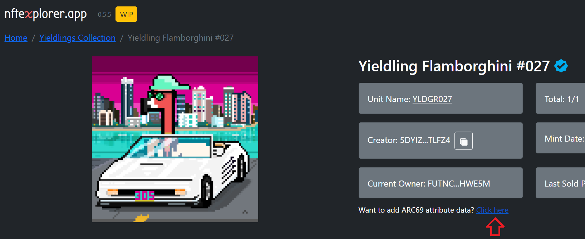

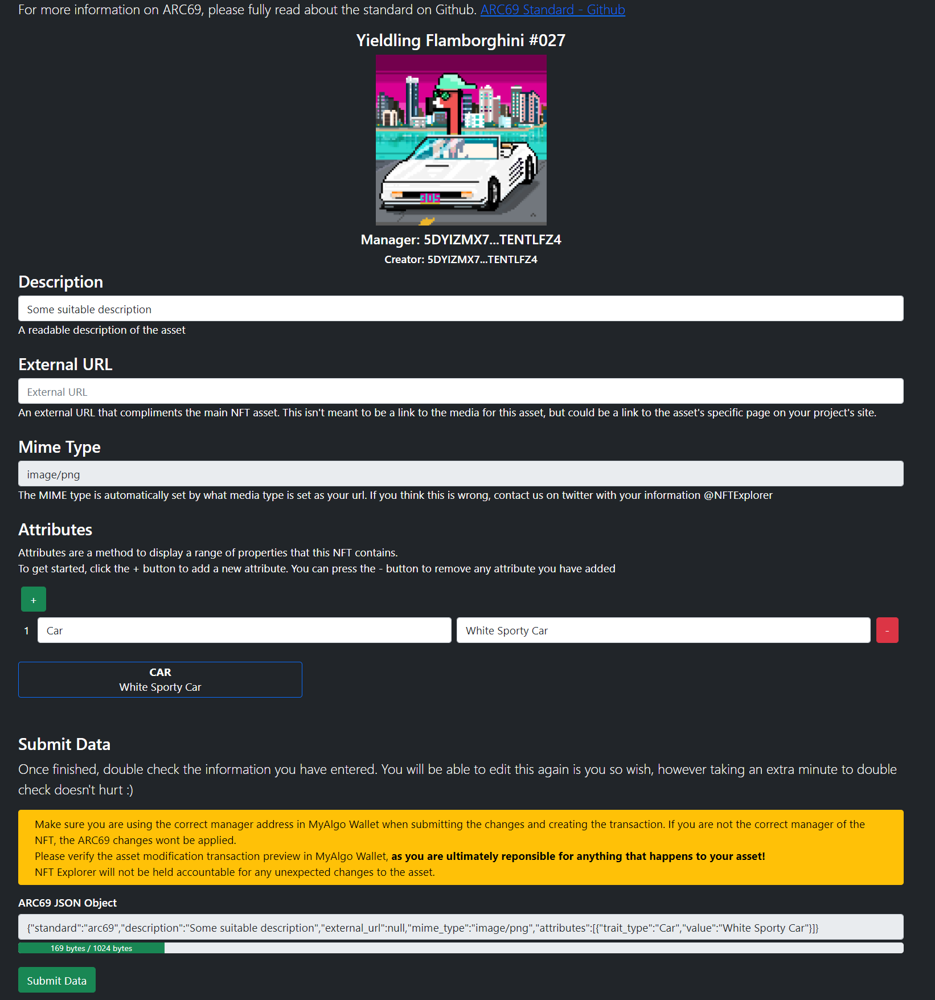

The mime/media-type is automatically populated.

### a) Edit ARC69

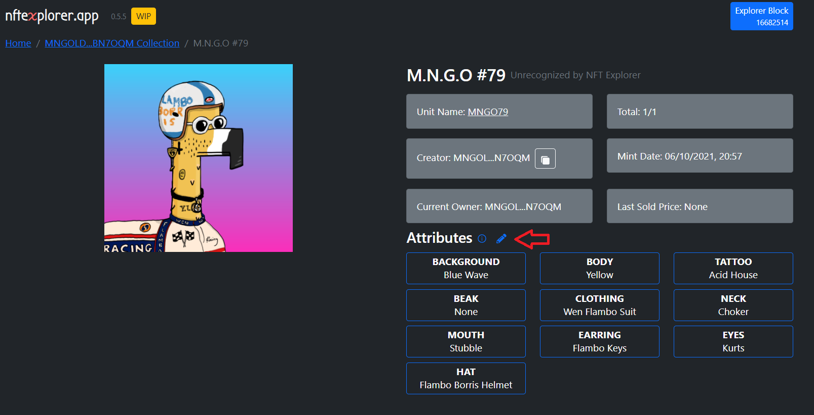

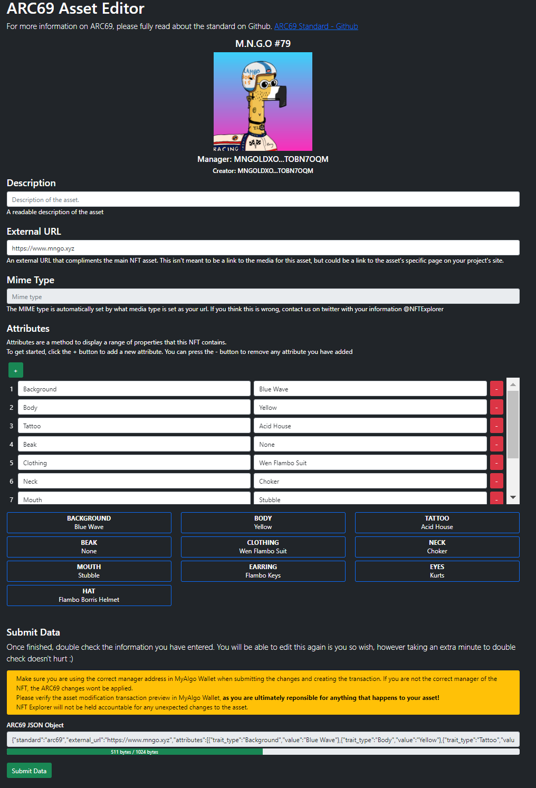

## 3) Submit

Sign and send securely with myalgo wallet.
Note that you must be the asset manager or the transaction will fail.
Note that you must review all proposed changes both in nftexplorer app, but more importantly in myalgo wallet and take full responsibility before signing and submitting the transaction. 


# Manually

## 1) Copy and paste JSON here to verify it [https://jsonlint.com/](https://jsonlint.com/)

(Example ARC69 JSON)

```json
{
  "standard": "arc69",
  "description": "STUPIDHORSE 069",
  "external_url": "thurstober.com",
  "properties": {
    "Background Color":"Blue Sherbet", 
    "Coat Color":"Blue", 
    "Hair Style":"Lil Hat"
  }
}
```


## 2) Modify asset in AlgoDesk

### a) Modify asset in AlgoDesk

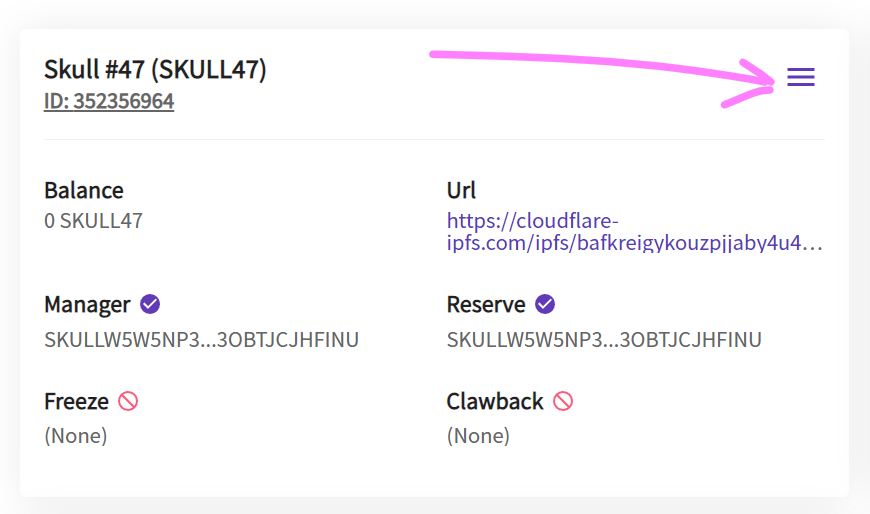

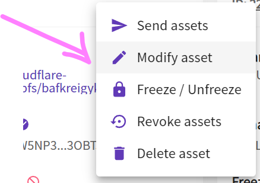

### b) Paste JSON into note field

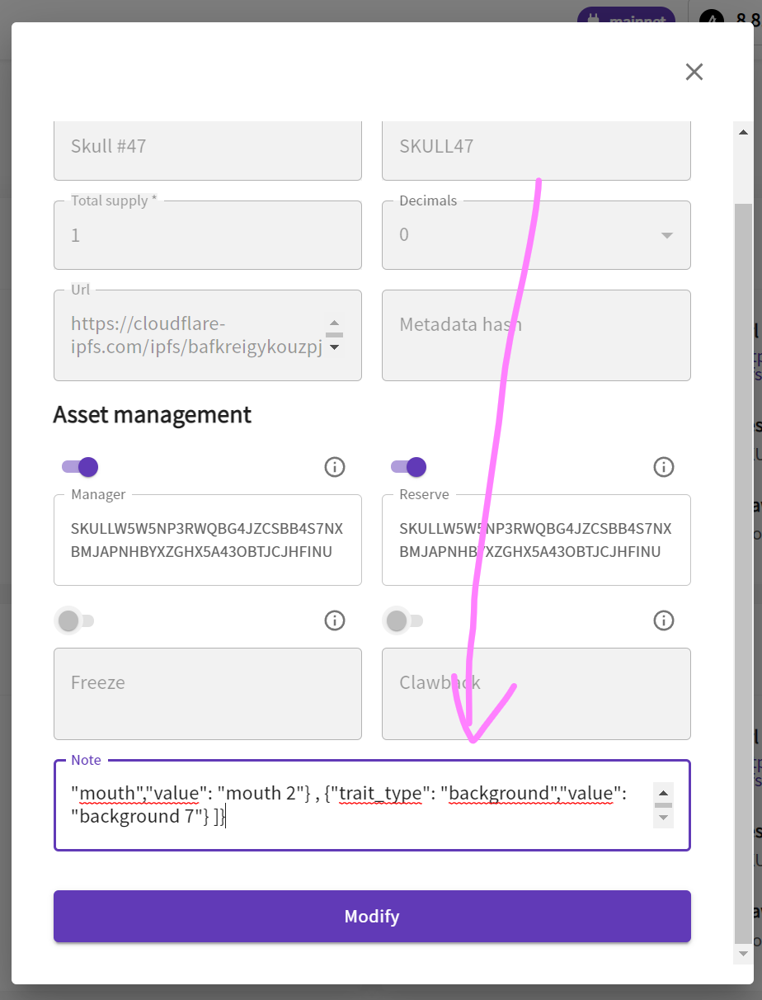

### c) Click Modify, and you're good

Note: You have unlimited retries 🙂, as long as you keep the Manager Address 🤵.


## 3) Modify asset in MyAlgo Asset Manager

### a) Go to MyAlgo Asset Manager

Go to: https://asset.myalgo.com/


### b) Edit the asset

To edit an asset click on the three vertical dots

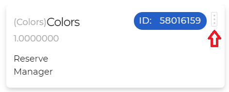

### c) Add the ARC69 Note

To be able to add the ARC69 Note you have to click Advanced

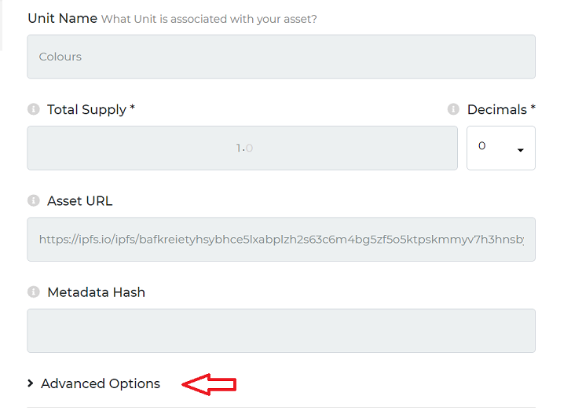

### d) Modify assets

Once you have pasted the note (JSON, compliant with ARC69), you can click Modify Asset.

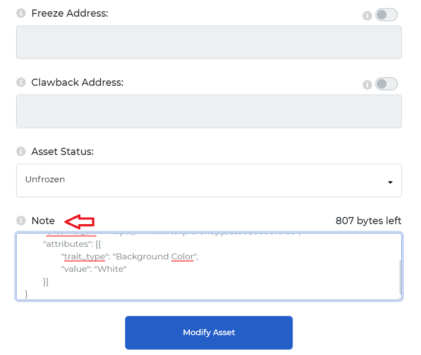


# Verify on Rand Gallery and NFT Explorer

-   [https://www.randgallery.com/algo-collection/?address=308075440](https://www.randgallery.com/algo-collection/?address=308075440)
    
-   [https://www.nftexplorer.app/asset/308075440](https://www.nftexplorer.app/asset/308075440)
    


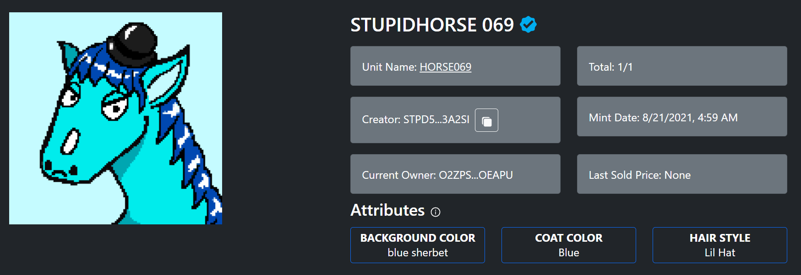
